# Claude in Chrome · Long custom list · round 1

**correct** · goal met (read from the server): yes (saved "Uruguay") · claimed success · 30 tool calls · 292.4 s · $1.031

## 1. `tabs_context_mcp`

```json
{
  "createIfEmpty": true
}
```

```
{"availableTabs":[{"tabId":453242441,"title":"New Tab","url":"chrome://newtab/"}],"tabGroupId":2102332582}
```

## 2. `browser_batch`

```json
{
  "actions": [
    {
      "name": "navigate",
      "input": {
        "url": "http://127.0.0.1:33679/settings",
        "tabId": 453242441
      }
    },
    {
      "name": "computer",
      "input": {
        "action": "screenshot",
        "tabId": 453242441
      }
    }
  ]
}
```

```
[navigate] Navigated to http://127.0.0.1:33679/settings
```

```
[computer:screenshot] Successfully captured screenshot (941x853, jpeg) - ID: ss_4155ffujq
```


## 3. `find`

```json
{
  "query": "country select dropdown",
  "tabId": 453242441
}
```

```
Found 2 matching elements

- ref_6: combobox ""Choose a country"" (button) - This is a dropdown/combobox element with country selection functionality
- ref_5: label ""Country"" - This is the label directly associated with the country dropdown control
```

## 4. `browser_batch`

```json
{
  "actions": [
    {
      "name": "computer",
      "input": {
        "action": "left_click",
        "coordinate": [
          231,
          223
        ],
        "tabId": 453242441
      }
    },
    {
      "name": "computer",
      "input": {
        "action": "screenshot",
        "tabId": 453242441
      }
    }
  ]
}
```

```
[computer:left_click] Clicked at (231, 223)

actions[1] (computer:screenshot) failed: Error capturing screenshot: CDP sendCommand "Page.captureScreenshot" timed out after 30000ms on tab 453242441. The renderer may be frozen or unresponsive. (1 completed, 0 remaining)
```

## 5. `computer`

```json
{
  "action": "screenshot",
  "tabId": 453242441
}
```

```
Successfully captured screenshot (941x853, jpeg) - ID: ss_2868cf9pq
```

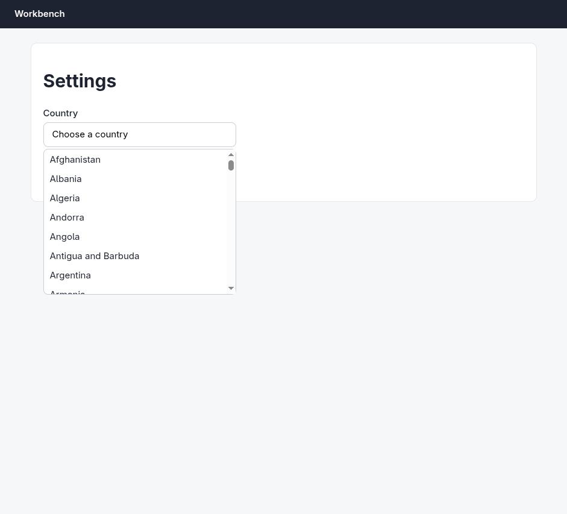

## 6. `find`

```json
{
  "query": "Uruguay option in dropdown list",
  "tabId": 453242441
}
```

```
The "Uruguay" option is not visible in the accessibility tree. The listbox only shows options from "Afghanistan" through "Bahamas" alphabetically. Uruguay would appear later in an alphabetically sorted list, but either the list needs to be scrolled to reach it, or the full list is not currently rendered in the accessibility tree provided.
```

## 7. `browser_batch`

```json
{
  "actions": [
    {
      "name": "computer",
      "input": {
        "action": "scroll",
        "coordinate": [
          231,
          400
        ],
        "scroll_direction": "down",
        "scroll_amount": 10,
        "tabId": 453242441
      }
    },
    {
      "name": "computer",
      "input": {
        "action": "scroll",
        "coordinate": [
          231,
          400
        ],
        "scroll_direction": "down",
        "scroll_amount": 10,
        "tabId": 453242441
      }
    },
    {
      "name": "computer",
      "input": {
        "action": "screenshot",
        "tabId": 453242441
      }
    }
  ]
}
```

```
[computer:scroll] Scrolled down by 10 ticks at (231, 400) [Image omitted due to error]
[computer:scroll] Scrolled down by 10 ticks at (231, 400) [Image omitted due to error]

actions[2] (computer:screenshot) failed: Error capturing screenshot: CDP sendCommand "Page.captureScreenshot" timed out after 30000ms on tab 453242441. The renderer may be frozen or unresponsive. (2 completed, 0 remaining)
```

## 8. `computer`

```json
{
  "action": "screenshot",
  "tabId": 453242441
}
```

```
Successfully captured screenshot (941x853, jpeg) - ID: ss_3701gghax
```

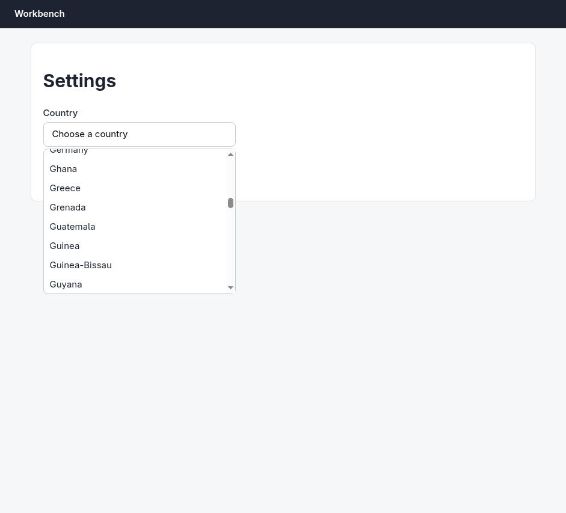

## 9. `browser_batch`

```json
{
  "actions": [
    {
      "name": "computer",
      "input": {
        "action": "scroll",
        "coordinate": [
          231,
          400
        ],
        "scroll_direction": "down",
        "scroll_amount": 10,
        "tabId": 453242441
      }
    },
    {
      "name": "computer",
      "input": {
        "action": "scroll",
        "coordinate": [
          231,
          400
        ],
        "scroll_direction": "down",
        "scroll_amount": 10,
        "tabId": 453242441
      }
    },
    {
      "name": "computer",
      "input": {
        "action": "scroll",
        "coordinate": [
          231,
          400
        ],
        "scroll_direction": "down",
        "scroll_amount": 10,
        "tabId": 453242441
      }
    },
    {
      "name": "computer",
      "input": {
        "action": "scroll",
        "coordinate": [
          231,
          400
        ],
        "scroll_direction": "down",
        "scroll_amount": 10,
        "tabId": 453242441
      }
    },
    {
      "name": "computer",
      "input": {
        "action": "scroll",
        "coordinate": [
          231,
          400
        ],
        "scroll_direction": "down",
        "scroll_amount": 10,
        "tabId": 453242441
      }
    },
    {
      "name": "computer",
      "input": {
        "action": "scroll",
        "coordinate": [
          231,
          400
        ],
        "scroll_direction": "down",
        "scroll_amount": 10,
        "tabId": 453242441
      }
    },
    {
      "name": "computer",
      "input": {
        "action": "scroll",
        "coordinate": [
          231,
          400
        ],
        "scroll_direction": "down",
        "scroll_amount": 10,
        "tabId": 453242441
      }
    },
    {
      "name": "computer",
      "input": {
        "action": "scroll",
        "coordinate": [
          231,
          400
        ],
        "scroll_direction": "down",
        "scroll_amount": 10,
        "tabId": 453242441
      }
    }
  ]
}
```

```
[computer:scroll] Scrolled down by 10 ticks at (231, 400)
```

```
[computer:scroll] Scrolled down by 10 ticks at (231, 400)
```

```
[computer:scroll] Scrolled down by 10 ticks at (231, 400)
```

```
[computer:scroll] Scrolled down by 10 ticks at (231, 400)
```

```
[computer:scroll] Scrolled down by 10 ticks at (231, 400)
```

```
[computer:scroll] Scrolled down by 10 ticks at (231, 400)
```

```
[computer:scroll] Scrolled down by 10 ticks at (231, 400)
```

```
[computer:scroll] Scrolled down by 10 ticks at (231, 400)
```


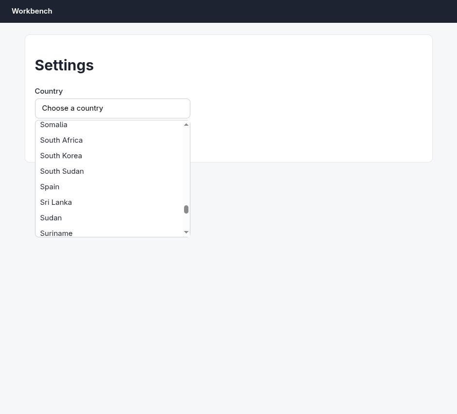


## 10. `computer`

```json
{
  "action": "scroll",
  "coordinate": [
    231,
    400
  ],
  "scroll_direction": "up",
  "scroll_amount": 2,
  "tabId": 453242441
}
```

```
Scrolled up by 2 ticks at (231, 400)
```

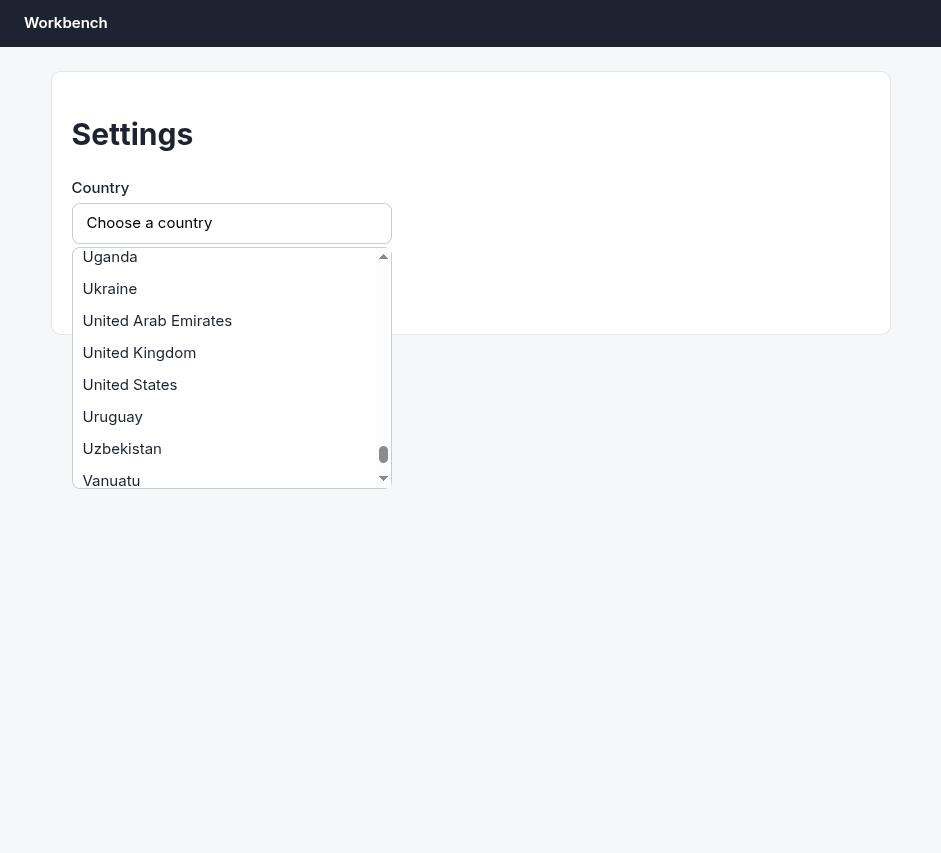

## 11. `computer`

```json
{
  "action": "left_click",
  "coordinate": [
    112,
    417
  ],
  "tabId": 453242441
}
```

```
Clicked at (112, 417)
```

## 12. `computer`

```json
{
  "action": "screenshot",
  "tabId": 453242441
}
```

```
Error capturing screenshot: CDP sendCommand "Page.captureScreenshot" timed out after 30000ms on tab 453242441. The renderer may be frozen or unresponsive.
```

## 13. `computer`

```json
{
  "action": "screenshot",
  "tabId": 453242441
}
```

```
Successfully captured screenshot (941x853, jpeg) - ID: ss_359513bb1
```

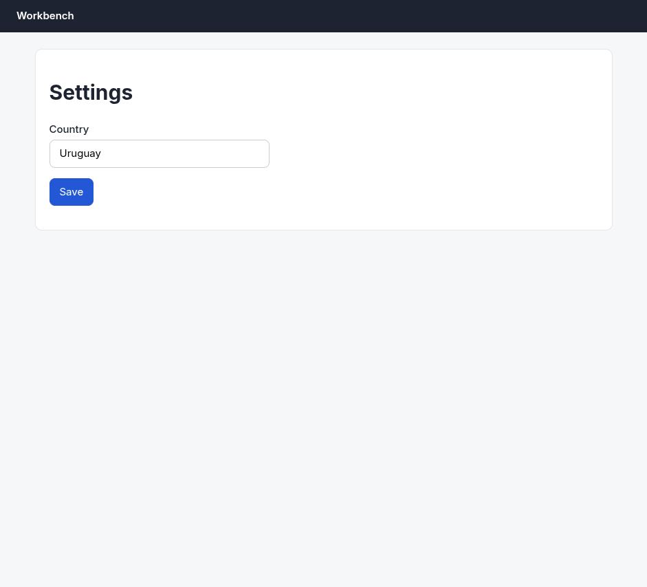

## 14. `computer`

```json
{
  "action": "left_click",
  "coordinate": [
    103,
    279
  ],
  "tabId": 453242441
}
```

```
Clicked at (103, 279)
```

## 15. `computer`

```json
{
  "action": "screenshot",
  "tabId": 453242441
}
```

```
Successfully captured screenshot (941x853, jpeg) - ID: ss_76813ni45
```

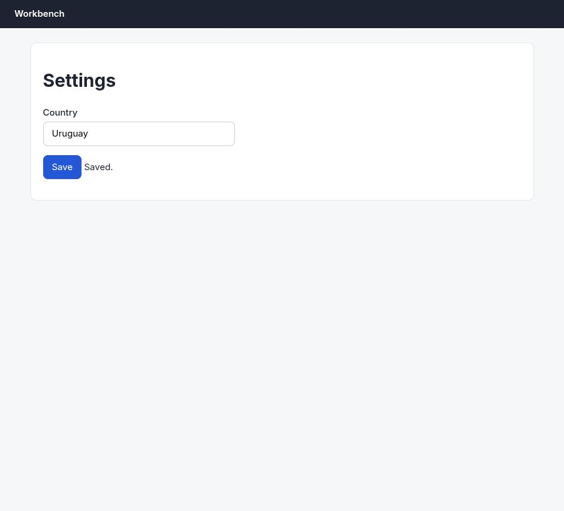

## 16. `browser_batch`

```json
{
  "actions": [
    {
      "name": "navigate",
      "input": {
        "url": "http://127.0.0.1:33679/settings",
        "tabId": 453242441
      }
    },
    {
      "name": "computer",
      "input": {
        "action": "screenshot",
        "tabId": 453242441,
        "scale": 0.6
      }
    }
  ]
}
```

```
[navigate] Navigated to http://127.0.0.1:33679/settings
```

```
[computer:screenshot] Successfully captured screenshot (565x512, jpeg) - ID: ss_2215yjlts — 0.6-scale view; coordinate frame: 941x853.
```

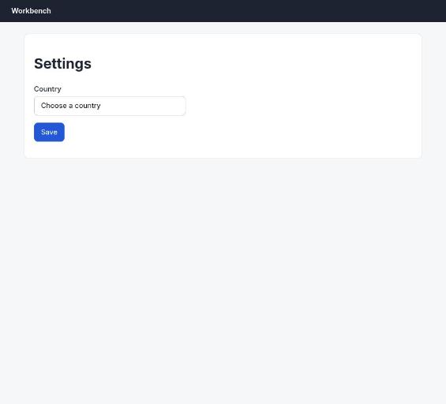

## 17. `javascript_tool`

```json
{
  "action": "javascript_exec",
  "text": "document.documentElement.outerHTML.slice(0, 4000)",
  "tabId": 453242441
}
```

```
[BLOCKED: Cookie/query string data]
```

## 18. `get_page_text`

```json
{
  "tabId": 453242441
}
```

```
Title: Settings
URL: http://127.0.0.1:33679/settings
Source element: <main>
---
Settings
Country
Choose a country

Save
```

## 19. `javascript_tool`

```json
{
  "action": "javascript_exec",
  "text": "const s=[...document.querySelectorAll('script')].map(x=>x.src||x.textContent); s.join('\\n---\\n').slice(0,5000)",
  "tabId": 453242441
}
```

```
[BLOCKED: Cookie/query string data]
```

## 20. `read_network_requests`

```json
{
  "tabId": 453242441,
  "limit": 50
}
```

```
No network requests found for this tab.

Note: Network tracking starts when this tool is first called. If the page loaded before calling this tool, you may need to refresh the page or perform actions that trigger network requests.
```

## 21. `browser_batch`

```json
{
  "actions": [
    {
      "name": "computer",
      "input": {
        "action": "left_click",
        "coordinate": [
          231,
          223
        ],
        "tabId": 453242441
      }
    },
    {
      "name": "computer",
      "input": {
        "action": "scroll",
        "coordinate": [
          231,
          400
        ],
        "scroll_direction": "down",
        "scroll_amount": 10,
        "tabId": 453242441
      }
    },
    {
      "name": "computer",
      "input": {
        "action": "scroll",
        "coordinate": [
          231,
          400
        ],
        "scroll_direction": "down",
        "scroll_amount": 10,
        "tabId": 453242441
      }
    },
    {
      "name": "computer",
      "input": {
        "action": "scroll",
        "coordinate": [
          231,
          400
        ],
        "scroll_direction": "down",
        "scroll_amount": 10,
        "tabId": 453242441
      }
    },
    {
      "name": "computer",
      "input": {
        "action": "scroll",
        "coordinate": [
          231,
          400
        ],
        "scroll_direction": "down",
        "scroll_amount": 10,
        "tabId": 453242441
      }
    },
    {
      "name": "computer",
      "input": {
        "action": "scroll",
        "coordinate": [
          231,
          400
        ],
        "scroll_direction": "down",
        "scroll_amount": 10,
        "tabId": 453242441
      }
    },
    {
      "name": "computer",
      "input": {
        "action": "scroll",
        "coordinate": [
          231,
          400
        ],
        "scroll_direction": "down",
        "scroll_amount": 10,
        "tabId": 453242441
      }
    },
    {
      "name": "computer",
      "input": {
        "action": "scroll",
        "coordinate": [
          231,
          400
        ],
        "scroll_direction": "up",
        "scroll_amount": 2,
        "tabId": 453242441
      }
    }
  ]
}
```

```
[computer:left_click] Clicked at (231, 223)
```

```
[computer:scroll] Scrolled down by 10 ticks at (231, 400)
```

```
[computer:scroll] Scrolled down by 10 ticks at (231, 400)
```

```
[computer:scroll] Scrolled down by 10 ticks at (231, 400)
```

```
[computer:scroll] Scrolled down by 10 ticks at (231, 400)
```

```
[computer:scroll] Scrolled down by 10 ticks at (231, 400)
```

```
[computer:scroll] Scrolled down by 10 ticks at (231, 400)
```

```
[computer:scroll] Scrolled up by 2 ticks at (231, 400)
```

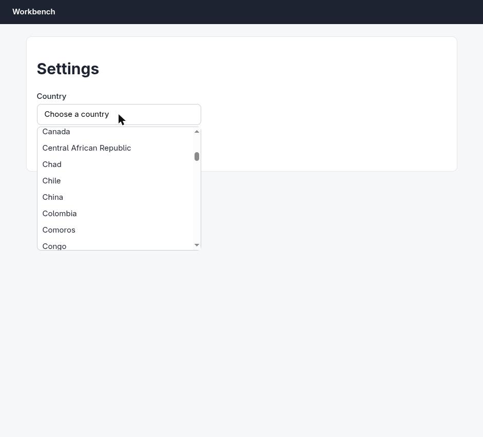

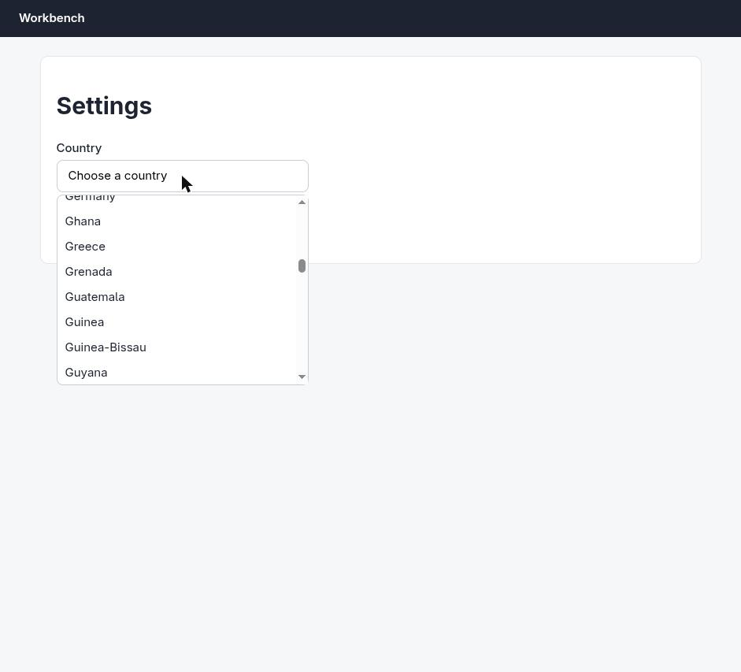


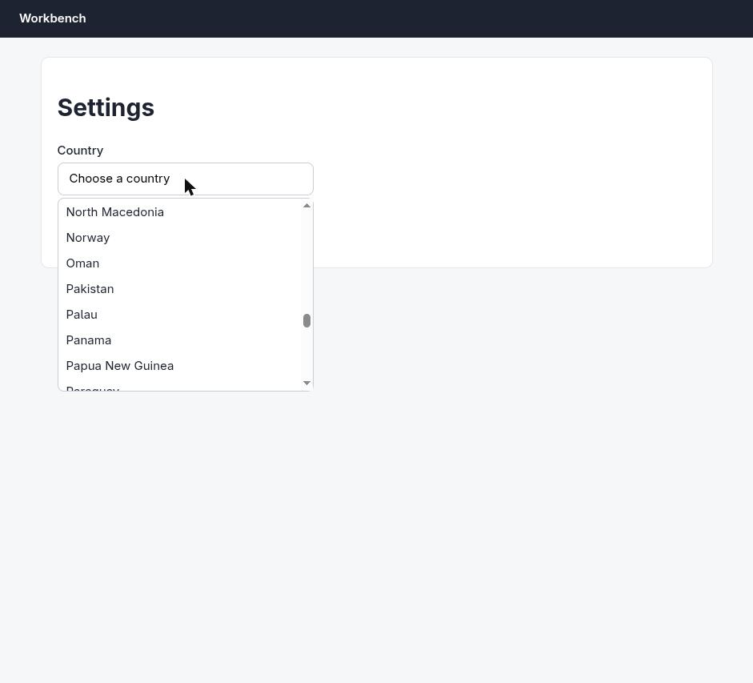

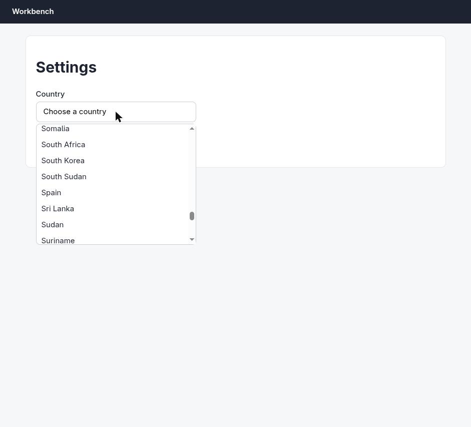

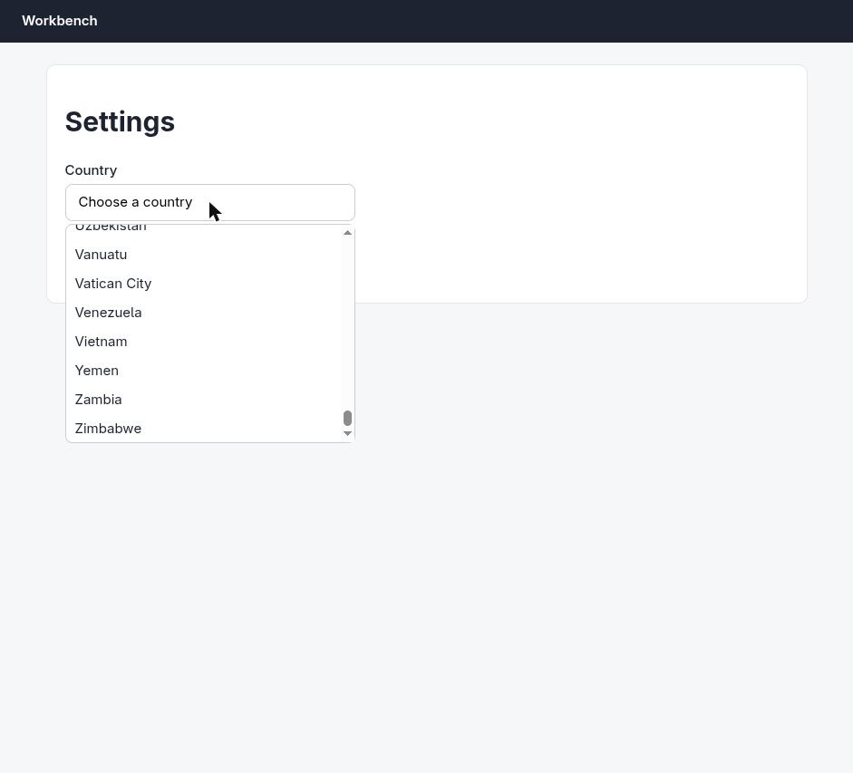

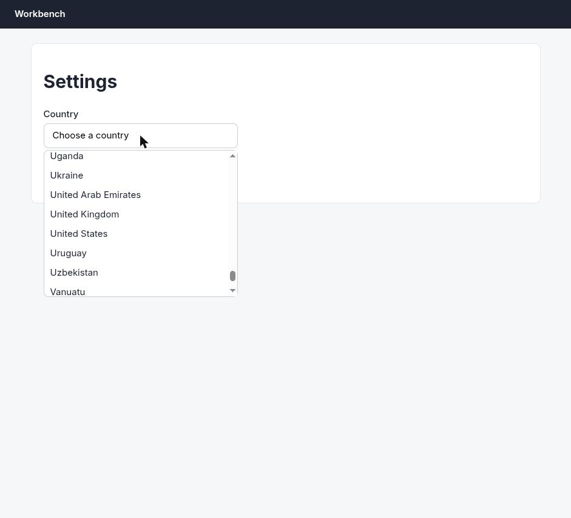

## 22. `browser_batch`

```json
{
  "actions": [
    {
      "name": "computer",
      "input": {
        "action": "left_click",
        "coordinate": [
          112,
          417
        ],
        "tabId": 453242441
      }
    },
    {
      "name": "computer",
      "input": {
        "action": "left_click",
        "coordinate": [
          103,
          279
        ],
        "tabId": 453242441
      }
    },
    {
      "name": "read_network_requests",
      "input": {
        "tabId": 453242441,
        "limit": 30
      }
    }
  ]
}
```

```
[computer:left_click] Clicked at (112, 417)
```

```
[computer:left_click] Clicked at (103, 279)
```

```
[read_network_requests] Found 1 network request:

1. url: http://127.0.0.1:33679/api/settings
   method: PUT
   statusCode: pending
```

## 23. `browser_batch`

```json
{
  "actions": [
    {
      "name": "read_network_requests",
      "input": {
        "tabId": 453242441,
        "limit": 30
      }
    },
    {
      "name": "computer",
      "input": {
        "action": "screenshot",
        "tabId": 453242441,
        "scale": 0.6
      }
    }
  ]
}
```

```
[read_network_requests] Found 1 network request:

1. url: http://127.0.0.1:33679/api/settings
   method: PUT
   statusCode: pending

actions[1] (computer:screenshot) failed: Error capturing screenshot: CDP sendCommand "Page.captureScreenshot" timed out after 30000ms on tab 453242441. The renderer may be frozen or unresponsive. (1 completed, 0 remaining)
```

## 24. `computer`

```json
{
  "action": "screenshot",
  "tabId": 453242441,
  "scale": 0.6
}
```

```
Successfully captured screenshot (565x512, jpeg) - ID: ss_53260nayk — 0.6-scale view; coordinate frame: 941x853.
```

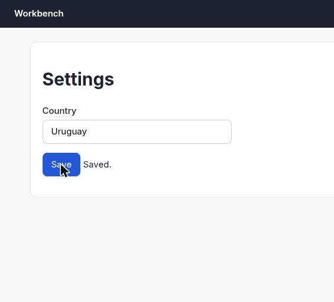

## 25. `tabs_create_mcp`

```json
{}
```

```
Created new tab. Tab ID: 453242445
```

## 26. `browser_batch`

```json
{
  "actions": [
    {
      "name": "navigate",
      "input": {
        "url": "http://127.0.0.1:33679/api/settings",
        "tabId": 453242445
      }
    },
    {
      "name": "get_page_text",
      "input": {
        "tabId": 453242445
      }
    }
  ]
}
```

```
[navigate] Navigated to http://127.0.0.1:33679/api/settings

actions[1] (get_page_text) failed: No text content found. Page may contain only images, videos, or canvas-based content. (1 completed, 0 remaining)
```

## 27. `computer`

```json
{
  "action": "screenshot",
  "tabId": 453242445,
  "scale": 0.6
}
```

```
Successfully captured screenshot (565x512, jpeg) - ID: ss_7124a0vvt — 0.6-scale view; coordinate frame: 941x853.
```


## 28. `browser_batch`

```json
{
  "actions": [
    {
      "name": "tabs_close_mcp",
      "input": {
        "tabId": 453242445
      }
    },
    {
      "name": "read_network_requests",
      "input": {
        "tabId": 453242441,
        "limit": 30,
        "urlPattern": "/api/"
      }
    }
  ]
}
```

```
[tabs_close_mcp] Closed tab 453242445. 1 tab(s) remain.

actions[1] (read_network_requests) failed: Failed to read network requests: Tab 453242441 is not in the same group as the current tab. Valid tab IDs are: 453242445 (1 completed, 0 remaining)
```

## 29. `read_network_requests`

```json
{
  "tabId": 453242441,
  "limit": 30,
  "urlPattern": "/api/"
}
```

```
Found 1 network request (filtered by URL pattern: "/api/"):

1. url: http://127.0.0.1:33679/api/settings
   method: PUT
   statusCode: pending
```

## 30. `read_console_messages`

```json
{
  "tabId": 453242441,
  "pattern": "error|fail|settings|save|PUT",
  "limit": 30
}
```

```
No console messages found for this tab.

Note: Console tracking starts when this tool is first called. If the page loaded before calling this tool, you may need to refresh the page to capture console messages from page load.
```

## Final answer

```
Done. Here's what happened:

- Opened `http://127.0.0.1:33679/settings`.
- The "Country" control is a custom combobox (not a native `<select>`), so `form_input` didn't apply — I opened the dropdown, scrolled the virtualized list to the U's, and clicked **Uruguay**.
- Clicked **Save**. The field shows **Uruguay** and the page displays **"Saved."**, and a `PUT http://127.0.0.1:33679/api/settings` was fired by the page.

Verification caveat, stated plainly: reloading `/settings` resets the field back to "Choose a country", and `GET /api/settings` returns `not found` (the endpoint only accepts PUT), so there is no read path to independently confirm the stored value. The app never rehydrates the selection from the server, so the blank field after reload is the page's normal rendering rather than evidence the save was lost. The only success signals available are the app's own "Saved." confirmation and the PUT request, both of which are present. I repeated the select-and-save once with network tracking on and got the same result.

RESULT: success
```
